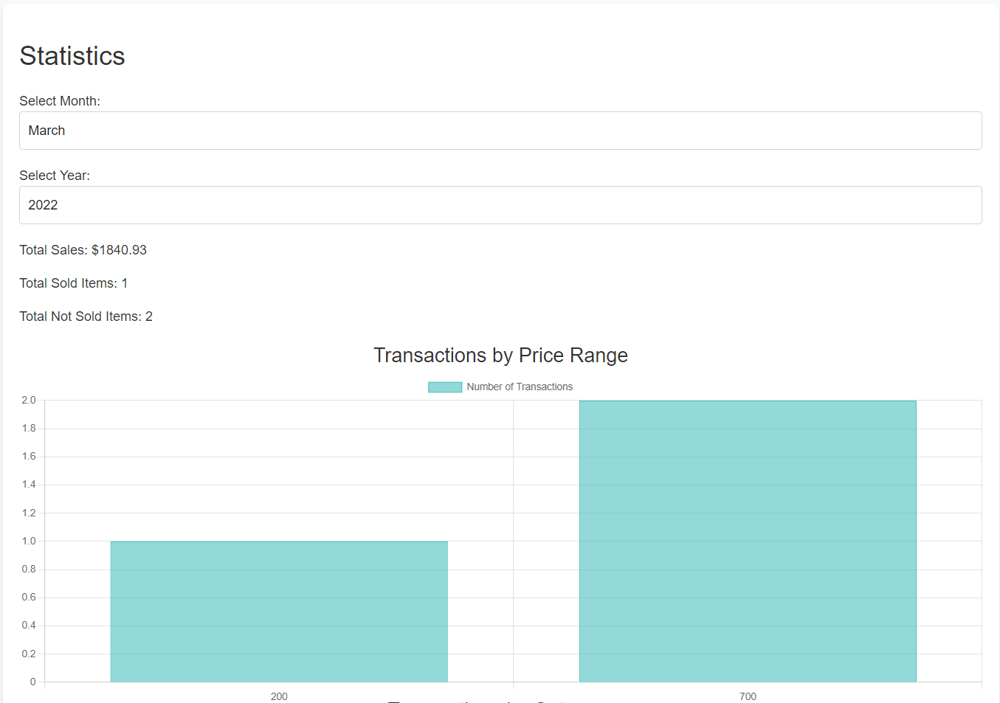
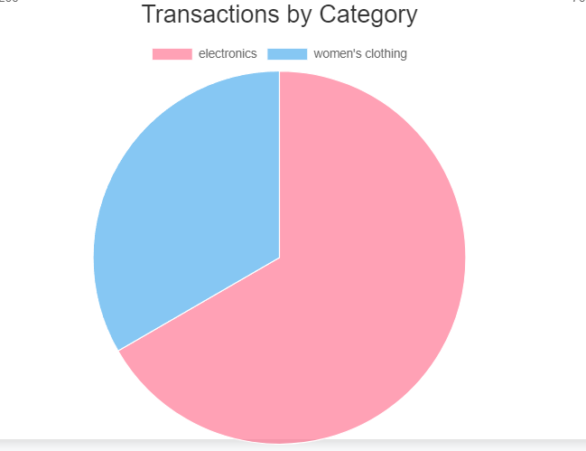
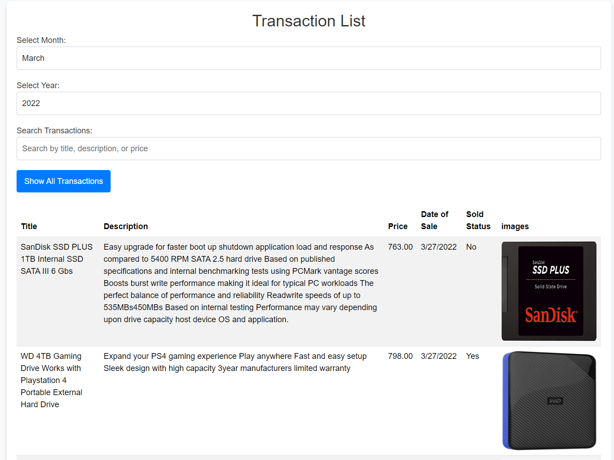

# Roxiler Systems - Technical Assignment

# **MERN Stack Coding Challenge**

This project implements a full-stack MERN application that allows users to view product transactions, analyze sales data, and visualize it using charts. The application integrates with a **third-party API** for fetching transaction data and provides various functionalities, including listing transactions, generating statistics, and rendering bar and pie charts.

## **Project Overview**

- **Data Source**: The transaction data is fetched from a third-party API.
  - **API URL**: `https://s3.amazonaws.com/roxiler.com/product_transaction.json`
  - **Request Method**: `GET`
  - **Response Format**: `JSON`

- **Frontend**: Built with **React.js** for listing transactions, displaying statistics, and rendering charts.
- **Backend**: Uses **Node.js** and **Express** to serve APIs for fetching and manipulating transaction data.
- **Database**: Uses **MongoDB** Initialized from the fetched transaction data and designed with an efficient structure.
  
## **Features**

### **1. Transactions Table**
- Lists all product transactions for the selected month.
- Supports **pagination** and **search** for transactions based on title, description, or price.
- **Default** month is March, and users can select months from a dropdown (January to December).

### **2. Statistics API**
- Fetches the **total sale amount**, **total sold items**, and **total not sold items** for a selected month.

### **3. Bar Chart API**
- Displays a **bar chart** with price ranges and the number of items sold in those ranges for a selected month.

### **4. Pie Chart API**
- Displays a **pie chart** showing the unique categories of items and the number of items per category for a selected month.

### **5. Combined API**
- Combines data from the **Transactions Table**, **Statistics**, and **Charts** APIs into a single response.


## **Frontend**

The frontend displays the following components on a single page:

### **1. Transactions Table**
- Lists transactions based on the selected month and allows **search** functionality.
- Displays paginated transaction data with **next** and **previous** buttons.

### **2. Transactions Statistics**
- Displays the **total sale amount**, **total sold items**, and **total unsold items** for the selected month.

### **3. Bar Chart**
- Visualizes the price ranges and the number of items sold in those ranges using a bar chart.

### **4. Pie Chart**
- Shows the number of items in each category for the selected month using a pie chart.

## **Installation and Setup**

1. **Clone the repository**:
   ```sh
   git clone https://github.com/sujaykhond/Roxiler-Systems---Technical-Assignment.git
   cd Roxiler-Systems---Technical-Assignment

2. **Install backend dependencies:**
   ```sh
   cd backend
   npm install

3. **Start the backend server:**
   ```sh
   npm start

4. **Install frontend dependencies:**
   ```sh
   cd ../frontend
   npm install

5. **Start the frontend server:**
   ```sh
   npm run dev

6.**Access the application at http://localhost:3000.**


## **Tools and Technologies**
    -Frontend: React.js, Tailwind CSS, Chart.js
    -Backend: Node.js, Express, MongoDB
    -API Integration: Fetching data from a third-party API

# Screenshots

1. **Bar Graph**
     - Visualizes the price ranges and the number of items sold in those ranges using a bar chart.
   
      


2. **Pie Chart**
     - Shows the number of items in each category for the selected month using a pie chart.

       


3.  **Transactions Table**
      - Lists transactions based on the selected month and allows **search** functionality.
      - Displays paginated transaction data with **next** and **previous** buttons
     
        
    

    
    


